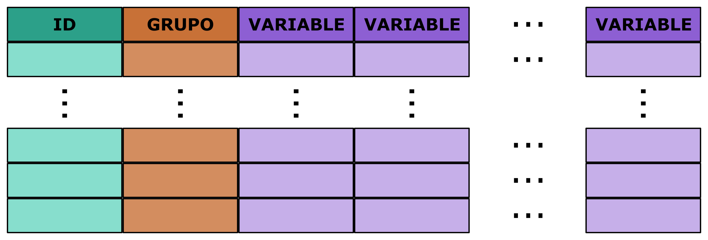

# Streamlit Concurso 2023

**Análisis de Componentes Principales y Modelización**

## Introducción

Esta aplicación es una herramienta de análisis de datos construida con Streamlit para el [Concurso de Streamlit en Español 2023](https://discuss.streamlit.io/t/anunciando-el-concurso-de-streamlit-en-espanol/40274). La aplicación está diseñada para analizar un conjunto de datos utilizando el Análisis de Componentes Principales (PCA) y buscar modelos con las componentes principales generadas.

Con esta aplicación, los usuarios podrán explorar y visualizar su conjunto de datos de una manera interactiva, identificando las variables más importantes que contribuyen a la variabilidad de los datos. Además, podrán seleccionar las componentes principales que desean utilizar y ajustar los parámetros del modelo para obtener los resultados óptimos.

Con Streamlit, se ha creado una interfaz de usuario intuitiva y fácil de usar que permite a los usuarios cargar su conjunto de datos, realizar un análisis PCA y probar diferentes modelos para encontrar la mejor solución para sus necesidades de análisis de datos.

[¡Anunciado el Concurso de Streamlit en Español!](https://discuss.streamlit.io/t/anunciando-el-concurso-de-streamlit-en-espanol/40274)


## Requerimientos

Con requisitos nos referimos a la configuración técnica del proyecto. Si estamos trabajando con Python tenemos que describir el entorno, enumerar los paquetes utilizados y sus versiones.

En los siguientes códigos se muestra cómo trabajar con los entornos y cómo guardar la configuración del proyecto. Este es un paso muy importante ya que nos permitirá reproducir el mismo análisis en el futuro aunque cambien las versiones de los paquetes

```
conda activate streamlit-concurso-2023
```

Una forma de guardar la configuración con conda es la siguiente

```
conda list --export > project-package-list.txt
conda list --explicit > project-package-explicit-list.txt
conda info > project-info.txt
conda env export > project-env.yaml
```

Si queremos reproducir el análisis podemos crear o reproducir el mismo entorno con el siguiente comando

```
conda env create -f project-env.yaml 
```

Se puede definir el nombre del nuevo entorno con una de las dos opciones siguientes

```
conda env create -n new-name -f project-env.yaml
conda env create --name new-name --file project-env.yaml
```

Y entonces se puede activar este nuevo entorno

```
conda activate project
```

Cuando no necesitemos este entorno podemos eliminarlo

```
conda env remove --name project
```

## Datos

Hay dos conjuntos de datos junto con los respectivos ficheros de configuración como ejemplo. Los dos conjuntos de datos tienen la misma estructura. Una primera variable `ID` identificado la observación con un código (`Streamlit-concurso-2023-`), una variable `GRUPO` mediante la que se asociarán las observaciones a dos grupos y un conjunto de variables (`VAR-`).

  * `./data/ejemplo01.xlsx` Este fichero de datos cuenta con 20 observaciones distintas y 351 variables. El fichero de configuración asociado a este conjunto de datos es `./code/config_ejemplo01.yaml`.
  
  * `./data/ejemplo02.xlsx`Este fichero de datos cuenta con 50 observaciones distintas y 100 variables. El fichero de configuración asociado a este conjunto de datos es `./code/config_ejemplo02.yaml`.
  
  
Los datos mostrados en `./data/ejemplo02.xlsx` se han generado mediante la función `make_biclusters()` de la librerías `sklearn`. El código completo se muestra a continuación.

```
import pandas as pd
from numpy import abs, min
from sklearn.datasets import make_biclusters

N_ROWS_ = 50
N_COLS_ = 100
N_CLUSTERS_ = 2

dt = make_biclusters(shape = (N_ROWS_, N_COLS_), 
                     n_clusters = N_CLUSTERS_, 
                     noise = 50, 
                     minval = 0, 
                     maxval = 25.0, 
                     random_state = 42)

salida01 = pd.DataFrame(
    {'ID': ['Streamlit-concurso-2023-' + str(i+1).zfill(2) for i in range(N_ROWS_)],
     'GRUPO': ['Grupo A' if x else 'Grupo B' for x in dt[1][1]]})


salida02 = pd.DataFrame(dt[0], 
                        columns = ['VAR' + str(i+1).zfill(3) for i in range(N_COLS_)])

MIN_ = min(min(salida02))
MIN_ = MIN_ + MIN_/10
salida02 = salida02 + abs(MIN_)

pd.concat([salida01, salida02], axis = 1)\
    .to_excel('ejemplo02.xlsx', sheet_name = 'data', index = False)
```

La aplicación funcionará con cualquier set de datos siempre que se mantenga la estructura de columnas.



## Herramientas

La planificación y la elección de las herramientas adecuadas son fundamentales en cualquier proyecto de análisis de datos o data science. Las librerías y herramientas adecuadas pueden acelerar el proceso de análisis y hacerlo más eficiente y efectivo, permitiendo a los analistas centrarse en el problema en sí y no en las tareas tediosas de manipulación y procesamiento de datos. Además, elegir las herramientas adecuadas también puede permitir la reutilización de código y facilitar la colaboración con otros miembros del equipo.

Por otro lado, una planificación adecuada puede ayudar a garantizar que el proyecto se mueva en la dirección correcta, se alcancen los objetivos establecidos y se respeten los plazos. Esto puede implicar la definición clara de los objetivos del proyecto, la identificación de las tareas necesarias para alcanzarlos y la estimación del tiempo y recursos necesarios para cada una de ellas. La planificación también puede ayudar a identificar posibles problemas o obstáculos antes de que surjan y a mitigar su impacto en el proyecto. En resumen, la elección de herramientas adecuadas y la planificación efectiva son elementos esenciales para el éxito en cualquier proyecto de análisis de datos o data science.

### Python

Python es un lenguaje de programación popular entre los científicos de datos debido a su facilidad de uso y a la gran cantidad de bibliotecas y herramientas disponibles para el análisis de datos. Con Python, es posible realizar tareas de limpieza, manipulación, análisis y visualización de datos de manera eficiente. Además, Python cuenta con bibliotecas especializadas en machine learning y deep learning, lo que lo convierte en una herramienta muy poderosa para la construcción de modelos predictivos y clasificadores. La combinación de Python con herramientas como Jupyter Notebook y Pandas hace que sea fácil explorar y visualizar los datos de manera interactiva. En resumen, Python es una herramienta imprescindible en el kit de herramientas de cualquier científico de datos moderno.

#### Recursos

  * _Python for Data Analysis_ de Wes McKinney (2017): Es un libro que introduce el uso de Python en el análisis de datos y en particular, en el uso de la librería pandas.

  * _Python Data Science Handbook_ de Jake VanderPlas (2016): Un libro que cubre temas avanzados de Python para el análisis de datos, como la visualización de datos, el aprendizaje automático y la manipulación de datos con pandas.

### Streamlit

[Streamlit](https://docs.streamlit.io/en/stable/) es una herramienta cada vez más popular en el mundo del análisis de datos y la visualización de información. Se trata de un framework open source de Python que permite construir aplicaciones web interactivas y personalizadas de manera sencilla y rápida, sin necesidad de tener conocimientos avanzados de programación web.

Con [Streamlit](https://docs.streamlit.io/en/stable/), los científicos de datos pueden crear visualizaciones dinámicas, gráficos interactivos, paneles de control y aplicaciones de aprendizaje automático con solo unas pocas líneas de código. Además, la herramienta es altamente personalizable y ofrece una amplia variedad de widgets y opciones de configuración para que el usuario pueda ajustar la apariencia y la funcionalidad de la aplicación a sus necesidades específicas.

[Streamlit](https://docs.streamlit.io/en/stable/) también ofrece una serie de características útiles para el desarrollo de aplicaciones, incluyendo la recarga automática de la aplicación cada vez que se detecta un cambio en el código, el manejo de datos en caché para mejorar el rendimiento y la integración con otras herramientas de Python como pandas, matplotlib y scikit-learn.

En resumen, [Streamlit](https://docs.streamlit.io/en/stable/) es una herramienta valiosa para los científicos de datos que buscan crear aplicaciones web interactivas y personalizadas de manera rápida y sencilla, sin tener que preocuparse demasiado por los detalles de la programación web.

#### Recursos

  * _Getting Started with Streamlit for Data Science_ de Tyle Richards (2021).

  * _Streamlit: Turn Python Scripts into Beautiful Data Apps_ de Adrien Treuille, Thiago Teixeira y Amanda Kelly (2020).
  
  * _Data Visualization with Python and JavaScript_ de Kyran Dale (2016). Aunque no se centra exclusivamente en Streamlit, incluye varios ejemplos de cómo usar Streamlit para visualización de datos interactiva.
  
#### Ejecutar la Aplicación

Primero pudes clonar el repositorio

```
git clone https://github.com/imarranz/streamlit-concurso-2023
```

Una vez clonado el repositorio debes crear y activar el entorno (`./environment/streamlit-concurso-2023-env.yaml`). Posiblemente esta aplicación funcione bien en un entorno qur ya tenga instaladas las librerías necesarías (obviamente con _Strealit_ es obligatoria) pero por reproducibilidad es conveniente usar el mismo entorno.

Para lanzar una aplicación de [Streamlit](https://docs.streamlit.io/en/stable/) desde la consola con una dirección IP específica y un puerto, debes abrir la línea de comandos y navegar hasta el directorio donde se encuentra tu archivo Python que contiene la aplicación de [Streamlit](https://docs.streamlit.io/en/stable/). Luego, utiliza el siguiente comando:

```
streamlit run --server.address IP_ADDRESS --server.port PORT_NUMBER streamlit-concurso-2023.py
```

Sustituye `IP_ADDRESS` con la dirección IP que deseas usar y `PORT_NUMBER` con el número de puerto que deseas usar. Asegúrate de cambiar app.py con el nombre de tu archivo Python que contiene la aplicación de [Streamlit](https://docs.streamlit.io/en/stable/).

Por ejemplo, si queremos utilizar la dirección IP 192.168.1.452 y el puerto 8500, y el archivo de Python se llama _streamlit-concurso-2023.py_, el comando que se deberá ejecutar en la consola es:

```
streamlit run --server.address 192.168.1.452 --server.port 8500 streamlit-concurso-2023.py
```

Esto lanzará la aplicación de [Streamlit](https://docs.streamlit.io/en/stable/) en el navegador utilizando la dirección IP y el puerto especificados.

### YAML

[YAML](https://yaml.org/docs/) es un lenguaje de serialización de datos que se utiliza comúnmente como una herramienta de configuración en proyectos de software. Es fácil de leer y escribir para los humanos y es muy útil para definir la estructura de datos que un programa debe usar. [YAML](https://yaml.org/docs/) es especialmente útil en proyectos de data science y machine learning, donde a menudo se deben configurar modelos y procesos de entrenamiento de datos de manera precisa y detallada. Al utilizar [YAML](https://yaml.org/docs/), los desarrolladores pueden definir y gestionar las configuraciones de su proyecto de manera más sencilla y eficiente. Además, [YAML](https://yaml.org/docs/) es compatible con varios lenguajes de programación, lo que lo hace una opción popular para desarrolladores de diferentes lenguajes y plataformas.

#### Recursos

##### Libros

  * _Learning YAML_ de Steven Simpson
  
  * _YAML by Example_ de Mark Dunnett
  
  * _YAML: A Fresh Approach to Configuration_ de Pavel Tišnovský
  
  * _Python and YAML: Using YAML with Python_ de Martin Chikilian

##### Sitios Web

  * Documentación oficial de PyYAML: [https://pyyaml.org/wiki/PyYAMLDocumentation](https://pyyaml.org/wiki/PyYAMLDocumentation)

  * Tutorial de YAML en Python de TutorialsPoint: [https://www.tutorialspoint.com/yaml/yaml_python_example.htm](https://www.tutorialspoint.com/yaml/yaml_python_example.htm)

  * YAML Tutorial de Programiz: [https://www.programiz.com/python-programming/yaml](https://www.programiz.com/python-programming/yaml)

  * YAML en Python de Real Python: [https://realpython.com/python-yaml/](https://realpython.com/python-yaml/)

  * YAML en Python de GeeksforGeeks: [https://www.geeksforgeeks.org/yaml-in-python/](https://www.geeksforgeeks.org/yaml-in-python/)
  
##### Proyectos que usan YAML

No es dificil encontrar proyectos de análisis de datos que usan ficheros de configuración editables y modificables. Estos proyectos tienen una configuración básica que puede modificarse en función de las necesidades del proyecto.

  * [Jupyter Book](https://jupyterbook.org/en/stable/customize/config.html)
  
  * [ydata-profiling](https://github.com/ydataai/ydata-profiling)

